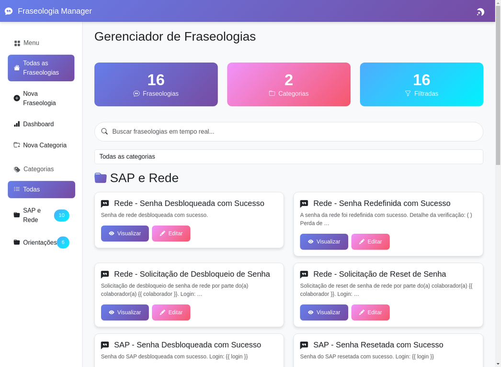
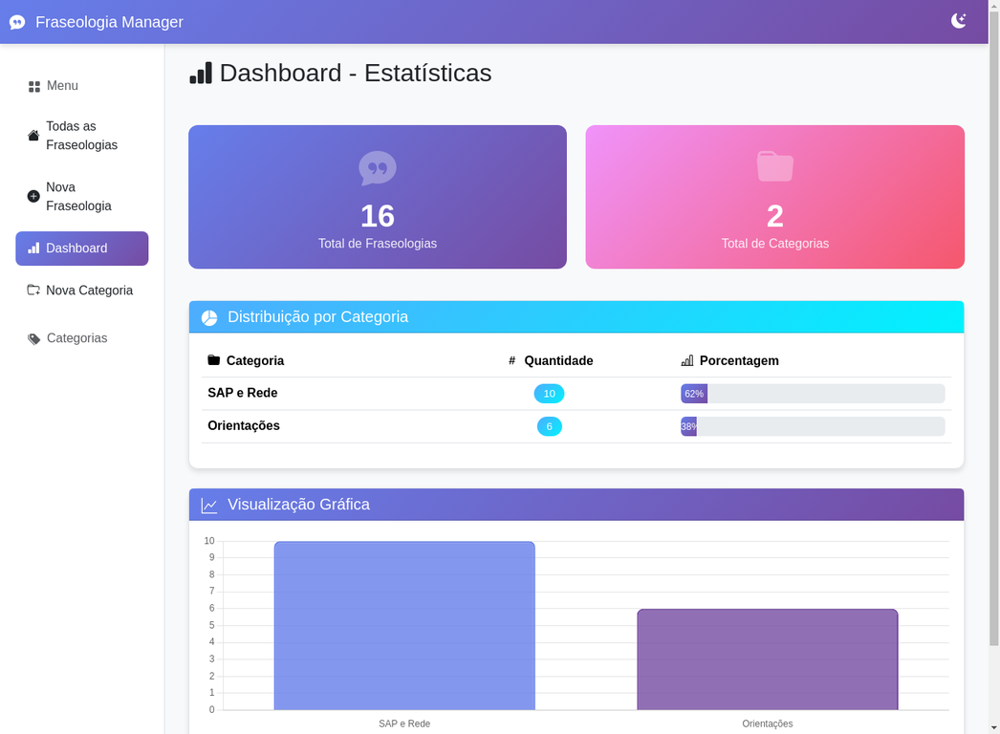

# 🎨 Gerenciador de Fraseologias

<div align="center">


**Sistema completo de gerenciamento de fraseologias com interface moderna, busca em tempo real e modo escuro/claro**

[Demo](#-demonstração) • [Instalação](#-instalação) • [Recursos](#-recursos) • [Tecnologias](#-tecnologias)

</div>

---

## 📋 Sobre o Projeto

O **Gerenciador de Fraseologias** é uma aplicação web desenvolvida em Django que permite criar, organizar e gerenciar fraseologias (templates de texto) de forma eficiente. Ideal para equipes de suporte, atendimento ao cliente ou qualquer cenário que exija respostas padronizadas.

### ✨ Principais Recursos

- 🔍 **Busca em Tempo Real** - Filtre fraseologias enquanto digita
- 📊 **Dashboard Estatístico** - Visualize métricas com gráficos interativos
- 🌓 **Modo Escuro/Claro** - Alterne entre temas com um clique
- 👁️ **Preview ao Vivo** - Veja o resultado do template em tempo real
- 📋 **Sistema CRUD Completo** - Criar, editar, visualizar e deletar
- 🏷️ **Organização por Categorias** - Mantenha tudo organizado
- 📱 **Design Responsivo** - Funciona perfeitamente em qualquer dispositivo
- 🎨 **Interface Moderna** - Gradientes vibrantes e animações suaves

---

## 🖼️ Demonstração

### Tela Principal - Modo Escuro
Interface moderna com cards de estatísticas e busca em tempo real.


### Tela Principal - Modo Claro
Alterne entre temas com um clique para melhor conforto visual.



### Dashboard com Estatísticas
Gráficos interativos mostrando a distribuição de fraseologias por categoria.



### Visualização de Fraseologia
Veja detalhes completos, copie com um clique e utilize variáveis dinâmicas.


---

## 🚀 Instalação

### Pré-requisitos

- Python 3.11 ou superior
- pip (gerenciador de pacotes Python)

### Passo a Passo

1. **Clone o repositório**
```bash
git clone https://github.com/seu-usuario/gerenciador-fraseologias.git
cd gerenciador-fraseologias
```

2. **Crie um ambiente virtual (recomendado)**
```bash
python -m venv venv
source venv/bin/activate  # Linux/Mac
venv\Scripts\activate     # Windows
```

3. **Instale as dependências**
```bash
pip install -r requirements.txt
```

4. **Execute as migrações**
```bash
python manage.py migrate
```

5. **Inicie o servidor**
```bash
python manage.py runserver
```

6. **Acesse a aplicação**
Abra seu navegador em: `http://localhost:8000`

### 🎯 Início Rápido (Scripts Automatizados)

**Windows:**
```bash
iniciar.bat
```

**Linux/Mac:**
```bash
./iniciar.sh
```

---

## 💡 Como Usar

### Criar Nova Fraseologia

1. Clique em **"Nova Fraseologia"** no menu lateral
2. Preencha o título e selecione uma categoria
3. Digite o template usando variáveis Django: `{{ variavel }}`
4. Veja o preview ao vivo
5. Clique em **"Salvar"**

### Buscar Fraseologias

- Digite na caixa de busca para filtrar em tempo real
- Use o dropdown de categoria para refinar os resultados
- O contador mostra quantas fraseologias estão visíveis

### Copiar Fraseologia

1. Clique em **"Visualizar"** em qualquer fraseologia
2. Clique no botão **"Copiar"**
3. Veja a notificação de sucesso
4. Cole onde precisar (Ctrl+V)

### Alternar Tema

- Clique no ícone de lua/sol no topo da página
- A preferência é salva automaticamente

---

## 🎨 Recursos Detalhados

### Interface Visual

- **Gradientes Modernos**: Roxo (#667eea), Rosa (#f093fb), Azul (#4facfe)
- **Animações Suaves**: Transições e efeitos hover
- **Cards Interativos**: Elevação ao passar o mouse
- **Modo Escuro Completo**: Contraste perfeito em todas as páginas

### Funcionalidades Técnicas

- **API Endpoints**: Busca e preview assíncronos
- **Renderização Django**: Templates com variáveis dinâmicas
- **Validação de Formulários**: Campos obrigatórios e feedback visual
- **Debounce na Busca**: Otimização de performance (300ms)
- **LocalStorage**: Persistência de preferências do usuário

### Dashboard

- Cards com estatísticas gerais
- Tabela de distribuição por categoria
- Gráfico de barras interativo (Chart.js)
- Porcentagens calculadas automaticamente

---

## 🛠️ Tecnologias

### Backend
- **Django 5.2.8** - Framework web Python
- **SQLite3** - Banco de dados

### Frontend
- **Bootstrap 5.3.3** - Framework CSS
- **Bootstrap Icons** - Ícones
- **Chart.js 4.4.0** - Gráficos interativos
- **JavaScript Vanilla** - Sem dependências extras

### Ferramentas
- **Python 3.11** - Linguagem de programação
- **pip** - Gerenciador de pacotes

---

## 📁 Estrutura do Projeto

```
gerenciador-fraseologias/
├── FraseologiaManager/      # Configurações do Django
│   ├── settings.py          # Configurações principais
│   ├── urls.py              # URLs do projeto
│   └── wsgi.py              # WSGI config
├── frases/                  # App principal
│   ├── models.py            # Modelos (Categoria, Fraseologia)
│   ├── views.py             # Views e API endpoints
│   ├── urls.py              # URLs do app
│   ├── admin.py             # Configuração do admin
│   └── templates/           # Templates HTML
│       └── frases/
│           ├── lista_fraseologias.html
│           ├── detalhe_fraseologia.html
│           ├── form_fraseologia.html
│           ├── confirmar_delete.html
│           ├── estatisticas.html
│           └── form_categoria.html
├── templates/               # Templates base
│   └── base.html            # Template base com navbar e sidebar
├── screenshots/             # Screenshots do projeto
│   ├── 01_pagina_principal_escuro.webp
│   ├── 02_pagina_principal_claro.webp
│   ├── 03_dashboard.webp
│   └── 04_visualizacao.webp
├── db.sqlite3               # Banco de dados
├── manage.py                # Gerenciador Django
├── requirements.txt         # Dependências
├── iniciar.sh               # Script Linux/Mac
├── iniciar.bat              # Script Windows
└── README.md                # Este arquivo
```

---

## 🔧 Configuração

### Variáveis de Ambiente

Para produção, configure as seguintes variáveis:

```env
DEBUG=False
SECRET_KEY=sua-chave-secreta-aqui
ALLOWED_HOSTS=seu-dominio.com
```

### Banco de Dados

O projeto usa SQLite por padrão. Para usar PostgreSQL ou MySQL:

1. Instale o driver apropriado
2. Configure `DATABASES` em `settings.py`
3. Execute `python manage.py migrate`

---

## 📊 Dados de Exemplo

O projeto inclui:
- **16 fraseologias** de exemplo
- **2 categorias**: "SAP e Rede" e "Orientações"
- Templates com variáveis para customização

---

## 🤝 Contribuindo

Contribuições são bem-vindas! Sinta-se à vontade para:

1. Fazer um fork do projeto
2. Criar uma branch para sua feature (`git checkout -b feature/MinhaFeature`)
3. Commit suas mudanças (`git commit -m 'Adiciona MinhaFeature'`)
4. Push para a branch (`git push origin feature/MinhaFeature`)
5. Abrir um Pull Request

---

## 📝 Changelog

### Versão 1.4 (Atual)
- ✅ Modo escuro com contraste perfeito em todas as páginas
- ✅ Ícones alinhados verticalmente
- ✅ Espaçamento adequado nos títulos
- ✅ Cores globais aplicadas

### Versão 1.0
- 🎉 Lançamento inicial com todos os recursos

Veja o [CHANGELOG.md](CHANGELOG.md) completo para mais detalhes.

---

## 📄 Licença

Este projeto está sob a licença MIT. Veja o arquivo [LICENSE](LICENSE) para mais detalhes.

---

## 👤 Autor

**Seu Nome**

- GitHub: [@seu-usuario](https://github.com/seu-usuario)
- LinkedIn: [Seu Nome](https://linkedin.com/in/seu-perfil)

---

## 🙏 Agradecimentos

- Bootstrap pela framework CSS incrível
- Chart.js pelos gráficos interativos
- Django pela excelente documentação
- Comunidade open source

---

## 📞 Suporte

Se você encontrar algum problema ou tiver sugestões:

- Abra uma [issue](https://github.com/seu-usuario/gerenciador-fraseologias/issues)
- Entre em contato via LinkedIn

---

<div align="center">

**⭐ Se este projeto foi útil, considere dar uma estrela!**

Feito com ❤️ e Django

</div>
